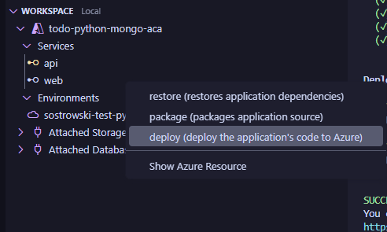
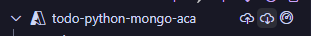

# Accelerate your workflow from local Python prototype to the cloud (PyCon US 2023)
This repo hosts materials for my session at PyCon US 2023.

- Have you ever struggled taking a Python application from your local machine to the cloud? 
- Had a hard time figuring out what infrastructure you need or how to configure it for your app? 
- Spent too much time researching how to set up your local development environment for cloud development? 

**Then, this talk/repo is for you!**

Learn how to use real-world cloud development application templates via CLI to go from local development environment to the cloud. Scaffold your application, provision resources, deploy code, monitor your application health, and set up a CI/CD pipeline, all in a couple of steps and just a few minutes.

This talk is 1 part talk ([slides](/PyCon2023-slides.pdf)) and 1 part workshop/DIY!

## **Workshop/DIY Prerequisites**

For the core `azd` experience, you'll want to:
1. [Sign up for a free Azure Account](https://azure.microsoft.com/free). You also need [contributor role assigned](https://learn.microsoft.com/en-us/azure/role-based-access-control/role-assignments-portal) to your Azure subscription.
1. Install `azd` - [aka.ms/azd-install](https://aka.ms/azd-install)

For [the template](https://github.com/Azure-Samples/todo-python-mongo-aca), you'll want to install:
1. [Docker](https://docs.docker.com/get-docker/)
1. [Python 3.8 +](https://www.python.org/downloads/)
2. [Node.js with npm (16.13.1+)](https://nodejs.org/en)

In VS Code, you'll want to install:
- [Azure Tools extension pack for VS Code](https://marketplace.visualstudio.com/items?itemName=ms-vscode.vscode-node-azure-pack), which includes the [Azure Developer CLI extension](https://marketplace.visualstudio.com/items?itemName=ms-azuretools.azure-dev)

## **The TL;DR (aka the _quick_ quickstart)**
> Please install the Azure Developer CLI and template dependencies(instructions above) before tackling the quickstart. You can also try this same quickstart with any template found on [aka.ms/awesome-azd](https://aka.ms/awesome-azd). If you choose another template, just replace the template parameter in the `init` command with the GitHub URL to the template repo.

Sometimes, you want to just get right into and read about all the specifics later! That's cool. Run through these commands to authenticate on Azure, initialize using a template, provision infrastructure, deploy code, see monitoring dashboards and set up a CI/CD pipelines.

Try this:
1. `azd auth login`
2. `azd init --template Azure-Samples/todo-python-mongo-aca` (in an empty directory)
3. `azd up`

As a bonus, you can also run these (if the template has dashboard infrastructure and a GitHub Actions or Azure Pipelines definition):
4. `azd monitor`
5. `azd pipeline config`

## **Quickstart tutorial with the details**
> Please install the Azure Developer CLI and template dependencies(instructions above) before tackling the quickstart. You can also try this same quickstart with any template found on [aka.ms/awesome-azd](https://aka.ms/awesome-azd). 

### **Authenticate!**
Run `azd auth login` in your terminal.

This will open a browser for you to authenticate on Azure.

### **Let's grab an application template!**
For this workshop/example, we're going to get https://github.com/Azure-Samples/todo-python-mongo-aca up and running on Azure in just a couple of minutes. This template uses React for the frontend, Python with FastAPI for the backend, Azure Cosmos DB for MongoDB for storage, and Azure Monitor for monitoring and logging. The template includes sample application code (a ToDo application) included as a proof-of-concept, infrastructure as code, and more!

Azure Developer CLI-compatible repos/templates are designed to be extensible and easy to customize. The idea is that you can find a template that matches your application's architecture (e.g. frontend, backend, database) and use the template as a foundational blueprint for getting your application up on Azure. 

Alright, let's grab the application template code.

1. Make a new directory - `mkdir pycon-azd-todo`
1. Change into that directory - `cd pycon-azd-todo`
1. Run `azd init --template Azure-Samples/todo-python-mongo-aca`. 

After running this `azd init` command, you'll be prompted for an environment name. The environment name is not your virtual environment. You should name it something that can help you identify the project and stage i.e. **todo-dev** etc.

Finally, let's open the project in VS Code by typing `code .`.

### **Provision infrastructure and deploy application code**
Now, let's run the `azd up` command. This command is a special, workflow-type command which will:
- Package your application code - in this case, we are going to build container images using Docker
- Provision infrastructure - as defined in `infra/`
- Deploy code on Azure - to Azure Container Apps

This step will take a couple of minutes. With this command, `azd` isn't  just getting your app hosted on Azure. It's setting up roles and permissions, Key Vault for storing secrets, wiring up our database, and more!

Options for running `up` in VS Code:
1. `azd up` in the terminal
1. Right-click on the `azure.yaml` in the root of the template and select `up` from the context menu
1. Open the command palette (ctrl+shift+p on Windows or cmd+shift+p on Mac), type "azd up" and select "Azure Developer: up"

After running this command, you'll be prompted for:
- An Azure subscription to use
- A location (eastus, westus, etc.) where your resources will be deployed

 At the end of this step you'll be able to see two endpoints for the frontend and backend of the app, all up on Azure.

> Tip: While `azd up` is running, take a look at what's included in the template! You'll notice that the template has:
> -	Real application code (`src/`) - provided as a proof-of-concept
> -	A `.vscode/` - includes a `launch.json `file to define debug configurations and a `tasks.json` file to define the configurations to start the web or API server for local development
> - A `.devcontainer/` - to define a Devcontainer/Codespaces configuration
> -	An `infra/` - hosts a collection of infrastructure as code assets written either in Bicep or Terraform to provision the right resources, deploy code on Azure and set up application monitoring
> - A `.github/` and `.azdo/` - contains a GitHub Actions workflow and Azure Pipeline definition respectively to test your application against real Azure resources on every commit
> - A `azure.yaml` - an `azd` specific file that defines application metadata (e.g. languages, hosts, paths to code needed to build the app)

### Exploring resources using the Azure Tools extension pack for VS Code
We can also install the [Azure Tools extension pack for VS Code](https://marketplace.visualstudio.com/items?itemName=ms-vscode.vscode-node-azure-pack) which will we can also see what resources and services were created after running `azd up` in an application view.

1. Click on the Azure icon in the siderail.
1. In the workspace view, you'll see that we have a visual representation of our `azure.yaml`. 
    

1. Right-click on the `web` node under `Services` and notice that there are contextually relevant `azd` commands like `azd deploy` (which would allow us to deploy our code on Azure for the frontend). 
    

1. We could even click on the "cloud down" icon to run `azd down` and destroy all the infrastructure and deployments related to this application.

    

### **Best practices - monitoring and CI/CD**
We all know that it's not enough to just get your application up on Azure. We want to set ourselves up for success in the future. Let's talk about monitoring and setting up CI/CD.

#### **Monitor your app**
As part of `azd provision` (which was run as part of the `azd up` command), we created some application monitoring infrastucture. In the `infra/main.bicep` of https://github.com/Azure-Samples/todo-python-mongo-aca, you'll find a [`monitoring`](https://github.com/Azure-Samples/todo-python-mongo-aca/blob/988a22d0f5d7c4d269b2e8ab6d09ea3f8cd9b4d1/infra/main.bicep#L138) module which created all the monitoring infrastructure and a dashboard for our application. By running the following command, you will be brought to that dashboard and see usage, performance and reliability metrics for your application.

Options for running `monitor` in VS Code:

1. `azd monitor` in the terminal
1. Right-click on the `azure.yaml` in the root of the template and select `monitor` from the context menu. Select "Application Insights Overview Dashboard" from the list and then "OK".
1. Open the command palette (ctrl+shift+p on Windows or cmd+shift+p on Mac), type "azd monitor" and select "Azure Developer: monitor".

This will bring you to a dashboard with performance, reliability and usage metrics for the deployed application.

#### **Configure a CI/CD pipeline with GitHub Actions**
Finally, let's talk about setting up CI/CD. Included in the template is a GitHub Action workflow file. To configure and enable the action, `azd` provides the `pipeline config` command/action which performs the following:
- Creates and configures the Service Principal on the Azure subscription
- If there is not a git repository configured, provides the needed mechanics to create/configure your repository as well as commit the code.
- Create a secure connection between Azure and your repository using GitHub secrets.
- Upon checking in the workflow file, runs the action.

Again, you can either run `azd pipeline config` via:
1. `azd pipeline config` in the terminal
1. Right-click on the `azure.yaml` in the root of the template and select `pipeline config` from the context menu.
1. Open the command palette (ctrl+shift+p on Windows or cmd+shift+p on Mac), type "azd pipeline config" and select "Azure Developer: pipeline config"

After this completes and your code is pushed to a GitHub repo, open up the Actions tab and see that a run of the pipeline is kicked off!

## Congrats! You deployed an application on Azure!
What's next? You can:
- Try out the same workflow above with another Python template on the Azure Developer CLI [template gallery](aka.ms/azd-python-templates).
- Try adding your own application code to a template
- Try [building your own template](https://learn.microsoft.com/en-us/azure/developer/azure-developer-cli/make-azd-compatible?pivots=azd-create)
  - If you create your own template/azd-compatible application, we'd love to add it to the gallery. [Submit a PR!](https://github.com/Azure/awesome-azd)

## **Additional Resources**
If you're interested in learning more, be sure to check out:
- Docs: [aka.ms/azd](https://aka.ms/azd)
- Azure Developer CLI GitHub: [github.com/azure/azure-dev](https://github.com/azure/azure-dev)
- Recordings of `azd` community standups: [aka.ms/azd-standups](https://aka.ms/azd-standups)
- awesome-azd Python templates (community + Microsoft-authored): [aka.ms/azd-python-templates](aka.ms/azd-python-templates)

